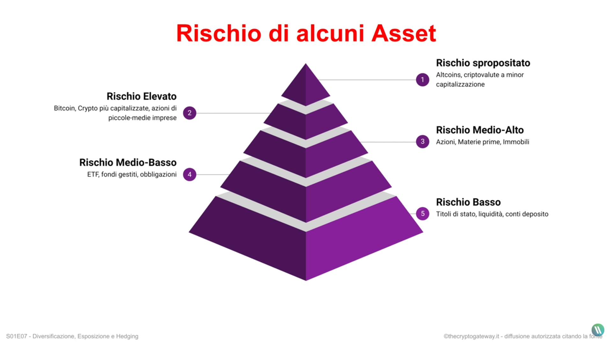

# Glossario

Da fare: cost averaging, **EDGE statistico, cluster, tvl**

## Base

- **ORDER BOOK**: rappresentazione visiva che mostra domanda e offerta.
- **LAST PRICE**: ultimo prezzo a cui si è venduto, il centro dell’order book.
- **MARKET PRICE**: prezzo di mercato in acquisto o vendita.
- **SPREAD:** la differenza tra domanda e offerta.
- **DEPTH CHART**: grafico che mostra la profondità del mercato mostrandolo sotto forma di linea. I “muraglioni” verdi o rossi significano che ci sono tantissima domanda o offerta (sarà più difficile muovere il prezzo in una direzione o nell’altra).
- **Stop Loss (SL)**:
- **Take Profit (TP)**:

## O**rdini**

- **Limit**: è un ordine di acquisto o vendita (Buy o Sell) inserito dentro l’order book ad un prezzo che definisco io (Limit Price) andando a mettere liquidità nell’order book, e rendendomi quindi un Market Maker.
- **Market**: ordine eseguito immediatamente al Market Price. In questo caso mi pongo nella posizione di Market Taker perché approfitto della liquidità altrui.
- **Stop**: ordine che inserisco quando il Last Price supera una soglia detta Stop Price (in acquisto o vendita ovvero Stop Buy o Stop Sell)

## Derivati e Margin trading

- Long: Posizione in profitto se rialzo
- Short: Profitto sul ribasso (guadagno se l’asset diminuisce di valore)
- Leva: Entità posizione aperta/Capitale Impiegato
(Margine).
- Liquidazione o Margin Call: Perdita del Margine
- Liquidation Price: Last Price alquale scatta la Liquidazione. Più vicino al prezzo d'ingresso tanto più è alta la leva.

## Grafico (base)

- **Cluster/Lateralizzazione**: movimento orizzontale del prezzo dentro un’area ristretta.
- **Higher High**: i massimi più alti dei precedenti.
- **Lower High**: massimo inferiore al precedente.
- **Higher Low**: minimo più alto. Definiscono il trend: direzionali del mercato.
- **Lower Low**: minimo più basso.
- **Trend:** può essere **bullish** o **bearish**, rispettivamente rialzista o ribassista.
- **Ritracciamento**: movimento contro trend, correttivo.

## M**ovimenti e pattern**

- **Pattern**: formazione caratterizzatile e ripetibile.
- **Break:** rottura (out se a rialzo, down se a ribasso). A volte seguiti da un *support to resistance flip.*
- **Breakout strutturale**: qualsiasi movimento che ****chiuda il corpo della candela sopra il minimo/massimo precedente ed è valido solo nel momento in cui il corpo della candela chiude sopra al livello attenzionato.
- **Traps**: falsi breakout o breakdown.
- **Setup**: opero per quello che ho definito sul grafico, lascio il minimo al caso. E’ uno schema definito in cui determino: **Entry Price**, **Stop Loss** (prezzo dove chiudo la posizione in perdita per contenere i danni), **Take Profit** (ovvero chiusura posizione in profitto perché ho raggiunto il mio target)

## Anomalie

- **Pump/dump**: quando il prezzo aumenta o crolla in maniera importante e repentinamente con volumi alti.
- **Spike**: shadow molto lunga, movimento repentino del prezzo subito respinto.
- **Stop hunting**: movimento breve e repentino finalizzato a innescare gli stop order in massa. Usato per manipolare il prezzo quando si è vicini a supporto o resistenza.
- **Bart**: è un pattern formato da impulso, lateralizzazione, impulso opposto al primo. Simile a testa di Bart!
- **Retest**: ritorno su un livello di supporto o resistenza della parte opposta

### Cosa **non fare**

- Dare valutazioni personali
- Non ammettere i propri errori
- Farsi influenzare dagli altri
- Voler dare un senso a ogni movimento del grafico
- Voler predire il mercato
- Dissonanze Cognitive (**bias**): si verifica quando ci sono pensieri in dissonanza, in contrasto con la propria idea iniziale, che ci fanno sentire a disagio. Sto facendo una cosa e mi viene in mente una cosa opposta, anche rispetto all’apertura delle mie posizioni (es. acquisto btc, ma il prezzo è già troppo alto). La tendenza umana che ci porta a comportarci in 3 modi: si ignorano, eevitano queste dissonanze, si alterano di importanza minimizzandoli oppure si adducono scuse a favore della propria idea iniziale. Tutto ciò altera gravemente la nostra percezione della realtà.

## Concetto di Rischio

- **R (rischio di capitale a rischio, Rp)**: capitale perso se il trade va in Stop Loss.
    - Meglio misurarlo in percentuale.
    - Pensarlo prima di aprire la posizione
    - Può variare anche durante il trade
- **Rischio di posizione**: quanto è probabile che il capitale vada in Stop Loss
- **Drawdown (Rischio di portafoglio, DD)**: quanto è probabile che il mio portafoglio subisca una notevole perdita
    - limitare l’esposzione concorde su asset correlati, limitare l’esposzione contro trend, limitare l’esposzione low TF, diversificare le posizioni, ridurre R, valutare pause operatve e esclusione di strategie
- **Risk to Reward Ratio (R/R)**: rapporto tra potenziale profitto e R
    - Decido lo SL, poi il TP, calcolo il risk to reward ratio (usando anche il % come unità di misura dei fattori)
- **Win Rate**: percentuale di trade chiusi in profitto
    - non deve essere per forza >50%
- **Equity Line**: grafico del nostro capitale nel tempo
    - X & Y: Capitale nella base currency (valuta principale) & Numero di Trade o Tempo

## Volatilità

deviazione standard del prezzo dalla sua media.

Lo **scopo dell’analisi della volatilità è definire la fase di mercato,** che può essere: 

- **Range trading** (fase di contrazione): lento, poco ampio, prolungato
- **Trending** (fase di espansione): impulsivo e sostenuto da volumi consistenti
- **Turbolenza:** l’apice del trend ormai esasperato, spesso si innesca da movimenti contrari. Sono i primi segni di incertezza del trend. Evitare di operare in questa fase.

Ci sono due indicatori per **valutare la volatilità** e renderla utile per i nostri trade:

- [**Bande di Bollinger**](https://thecryptogateway.it/trading-indicatori-bande-di-bollinger/): l’ampiezza mostra quanta deviazione standard c’è dalla media del prezzo. Quando sono ampie ho una fase di espansione, quando sono vicine tra loro, di contrazione. Il suo difetto è il ritardo, perché si basa sui campioni precedenti. Aiuta per analisi su TF più bassi (analisi sub-TF).
- **Average True Range**: indica l’intervallo medio nel quale si muove il prezzo nel campione. Le bande sono calcolate intorno ad una media e la deviazione standard è intesa dalla media. L’Average True Range tiene conto anche del prezzo. È utile anche nel calcolo dello SL.

> **A cosa serve analizzare la Volatilità?**
Nei momenti di espansione funzionano strategie ed indicatori “trend-follower”, basati sul movimento di prezzo.
Nei momenti di contrazione funzionano i “mean reversal”, basati sull’equilibrio del prezzo.
Più a lungo dura una fase di contrazione, più sarà forte quella di espansione che seguirà. Opportunità con ingresso anticipatore
Se il mercato è in fase di turbolenza, conviene lasciarlo raffreddare, perché ogni trade è rischiosissimo.
Se un trend è già attivo e molto forte (BBW alta), non è il momento di pianificare un ingresso.
Inizio di volatilità: pianificare entry sul primo ritracciamento
Lo Stop Loss non può prescindere dalla volatilità.
Mercato + volatile = conviene SL più largo e operatività più HTF. Mercato in contrazione: concesso SL più stretto.
Average True Range viene in aiuto, in caso di Trading Systems automatici.
Nelle fasi di estremo squeezing (BBW bassa su più TF), occorre mettere in conto che l’uscita, anche fake, dal range, provocherà turbolenze imprevedibili (e rischio scatto involontario SL)
> 

## Stop Loss

- Lo SL è **obbligatorio**. Senza lo Stop Loss non c’è strategia,
- Conviene usare un market order per essere sicuri che lo Stop venga eseguito.
- Non deve esistere trade senza Stop Loss perché purtroppo **occorre essere pronti a dire: ho sbagliato**.
- Non allungare mai lo Stop Loss dopo che la posizione è già stata aperta

Esistono diversi tipi di SL:

- **Classico**: apro la posizione e piazzo lo Stop ad un determinato prezzo.
- **Dopo il candle close**: lo posiziono e chiudo la posizione di perdita solo se la candela di un preciso time frame prestabilito chiude ad un certo prezzo. Aiuta per gli stop hunters.
- **Trailing Stop**: è uno Stop Loss mobile. Scelgo lo Stop di partenza, dopodiché, se la posizione si evolve in profitto, lo sposto di conseguenza. Preservo sempre di più la posizione minimizzando il rischio.

> **Thinking process**
Definisco il setup (perché apro la posizone?); definisco lo SL (che prezzo deve raggiungere per invalidare il setup?); definisco il TP; calcolo il R/R; valuto la bontà dell’idea
> 
- Attenzione agli stop hunting, mettere lo SL non in zone ovvie, oltre le shadows
- Frammentare lo SL
- Più aumento il TF, più aumento il respiro dello SL

## Diversificazione, Hedging (avanzato)

Guardare anche gli esempi di investimenti

Ogni tot di tempo pensare ad un **ribilanciamento del portafoglio**.

**Altri metodi diversificazione**

- **Time Frame**: un trading più aggressivo (minor TF), comporta rischio maggiore.
    - Il capitale su LTF dovrebbe sempre essere molto limitato.
- **Strategica**: allocando il capitale su trades basati su setup differenti, si mitiga leggermente il rischio complessivo, pur rimanendo legati al rischio degli asset sui quali si è esposti.
- **Hedging**, finalizzato a coprirsi da movimenti del Mercato che ci mettono a rischio di alto drawdown, causato da sovraesposizione verso certe situazioni o asset.

### **Il concetto di Hedging**

- Hedging su **singolo asset** (SHORT + LONG) -> giocandosi bene entry e stop loss per trarre vantaggio da entrambi gli esiti
- **Hedging A/B/C**: se A/B è in downtrend, ma A/C e B/C sono in uptrend correlato, posso operare LONG su A/C e SHORT su B/C, ottenendo un “effetto leva” sbilanciato a mio favore
- **Hedging multi TF**: posizione HTF su trend primario + posizione inversa LTF su trend minori

## CEX vs DEX

Quali sono le più grandi **differenze** che ci sono tra gli **exchange centralizzati** (CEX) e **decentralizzati**(DEX)?

La prima, e più importante, è la possibilità di detenere le proprie chiavi private. Non dimentichiamo che quando deteniamo criptovalute all’interno di un CEX, exchange centralizzato, non saremo più i gli unici proprietari delle chiavi private e quindi nemmeno delle nostre monete, ma andremo a delegarne la responsabilità alla piattaforma. Invece, utilizzando un DEX, saremo sempre i proprietari delle chiavi poiché sfrutteremo gli [smart contract](https://thecryptogateway.it/smart-contract/) che ci permetteranno di scambiare monete senza doverle detenere all’interno dei suoi server.

Oltre a questa prima grande differenza, dobbiamo sottolineare che i **CEX sono**, appunto, **centralizzati** e quindi a controllarli sarà una vera e propria società con il compito di **gestire i server** e tutte le **transazioni** che avvengono all’interno dell’exchange. Questo non è possibile in un **DEX**, ovvero una piattaforma **decentralizzata** e quindi **priva** di un **potere centrale o di un server centrale**. Dietro ad un DEX non ci sono nemmeno Titolari, ma piuttosto dei programmatori che hanno sviluppato la DApp in origine e che, una volta lanciata l’applicazione, detengono solo una percentuale di maggioranza dei token della piattaforma, ma nulla di più.

Se volete approfondire tutto il mondo della DeFi, e vi consiglio di farlo, potete farlo [qui](https://thecryptogateway.it/tutorial-defi/).

## DeFi

**Collateralizzazione**: vincolare il proprio asset ad una piattaforma, per poter prendere un prestito pari ad una parte del controvalore dell’asset collateralizzato.

**Stablecoin**: monete vincolate al prezzo di una valuta FIAT e quindi stabili rispetto alle fluttuazioni di mercato. Un esempio di stablecoin è USDC che segue l’andamento del Dollaro americano.

Nei Dex:

**Token LP**: Versando due (o più) token in un pool, otteniamo un cosiddetto Token LP. Esso mantiene un rapporto tra i due token (di solito 50% e 50%) pesato in dollari o altra valuta tradizionale., variando il suo valore quindi in funzione della coppia di asset.

**AMM (Automated Market Maker)**: protocolli decentralizzati che, raggruppando liquidità in un pool, permettono a chiunque di fornire dei token (Liquidity provider) in cambio di parte delle commissioni richieste per lo scambio degli stessi (da parte di utenti che voglio fare gli swap, che vengono subito girate al LP, incentivandoli a fornire liquidità ed il processo di scambio delle coin)

**LP (Liquidity Provider)**: colui che, fornendo due token diversi o più, aggiunge liquidità a un pool gestito da un protocollo per gli swap. + trasazioni = reward + alti, ma attenzione, rendite elevate può spesso voler dire anche scarsa liquidità nel pool, aumentando il rischio di perdere i fondi,

## Altro

### Cost Averaging

Per attuarlo, devo dividere il mio capitale da investire in lotti:

- Lottizzazione Costante: 10 lotti da 2k
- Lottizzazione lineare: l1=500, l2=1000, l3=1500, ...
- Lottizzazione esponenziale: l1=500, l2=1000, l3=2000, ...

Dopodiché, scelgo l’entry point iniziale

da continuare con [questo video](https://youtu.be/zDg5Patgbow?t=339)